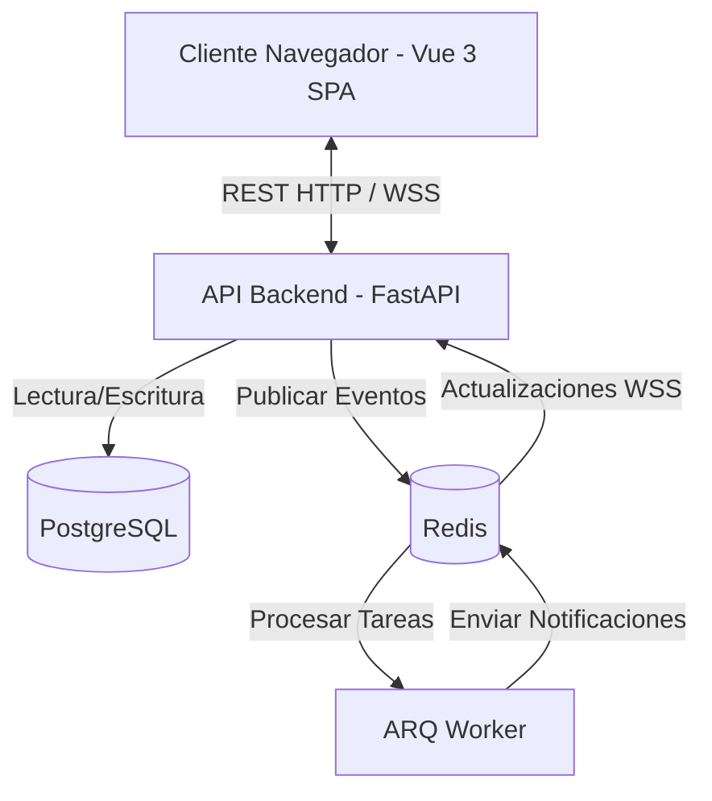

# Arquitectura de CoreStream

CoreStream es una plataforma de gestión de proyectos y tickets para equipos de desarrollo. Utiliza una arquitectura moderna y desacoplada con un frontend en Vue 3 y un backend en FastAPI.

## Resumen del Stack

| Capa | Tecnología |
|---|---|
| **Frontend** | Vue 3 + TypeScript + Vite + Pinia + Tailwind CSS |
| **Backend** | FastAPI (Python 3.11) |
| **Base de Datos** | PostgreSQL |
| **Caché / Mensajería** | Redis |
| **Tiempo Real** | WebSockets |

## Flujo del Sistema

## 1. Frontend (Vue 3)
El frontend es una Single Page Application (SPA) construida con la Composition API de Vue 3 y empaquetada con Vite.

- **Gestión de Estado**: Manejado por Pinia (`authStore`, `ticketsStore`, etc.).
- **Enrutamiento**: Vue Router para la navegación.
- **Estilos**: Tailwind CSS para un estilizado basado en utilidades.
- **Cliente HTTP**: Axios para las llamadas REST estándar.
- **Tiempo Real**: Composable personalizado `useWebSocket` para mantener una conexión persistente con el backend para actualizaciones en tiempo real (como cambios de estado de tickets).

## 2. Backend (FastAPI)
El backend provee endpoints RESTful y conexiones WebSocket. Es asíncrono por defecto.

- **Capa de Enrutamiento**: Separada por dominios (`auth`, `tickets`, `epics`, `notifications`, etc.).
- **Capa de Servicios**: La lógica de negocio está desacoplada del enrutamiento.
- **Acceso a Datos**: SQLAlchemy ORM con asyncpg para el acceso asíncrono a PostgreSQL.
- **Validación**: Pydantic v2 asegura una validación estricta de request/response.
- **Tareas en Segundo Plano**: El worker de ARQ utiliza Redis para procesar tareas pesadas (como envíos de correos o notificaciones masivas) de forma asíncrona sin bloquear las respuestas HTTP.

## 3. Base de Datos (PostgreSQL)
PostgreSQL almacena el estado persistente de la aplicación. 
Las entidades clave incluyen:
- `users`, `roles` (Sistema RBAC)
- `applications`, `epics`, `tickets`, `subtasks`
- `ticket_events` (registro de auditoría para las transiciones de estado)
- `notifications`

Las migraciones de la base de datos se gestionan usando Alembic.

## 4. Pub/Sub en Tiempo Real (Redis)
Redis sirve como la columna vertebral para las funciones en tiempo real.
Cuando cambia el estado de un ticket:
1. El backend guarda el cambio en PostgreSQL.
2. Se publica un evento en un canal de Redis (ej. `user:{id}:notifications`).
3. El worker de ARQ procesa el evento.
4. Las conexiones WebSocket activas reciben la carga JSON, actualizando el frontend en Vue instantáneamente.

## 5. Seguridad y Autenticación
- **Autenticación**: Se utilizan JWT (JSON Web Tokens) para el manejo de sesiones sin estado. Las contraseñas se encriptan usando `bcrypt`.
- **Autorización**: El Control de Acceso Basado en Roles (RBAC) restringe los endpoints a roles específicos (`ADMIN`, `TEAM_LEADER`, `DEVELOPER`).
